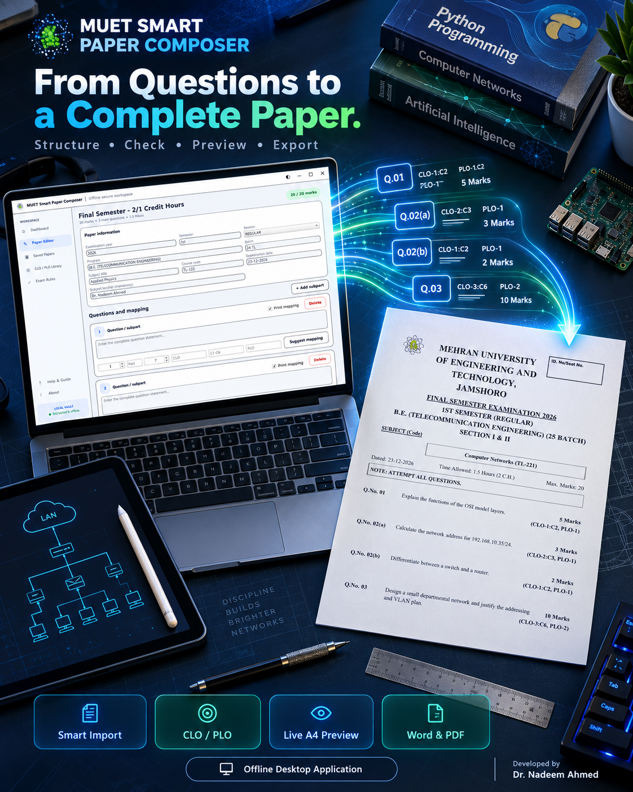
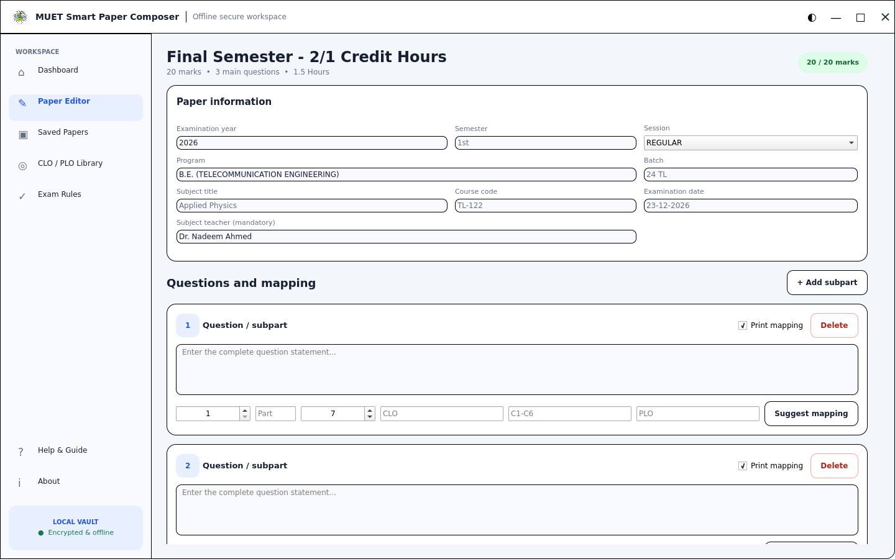
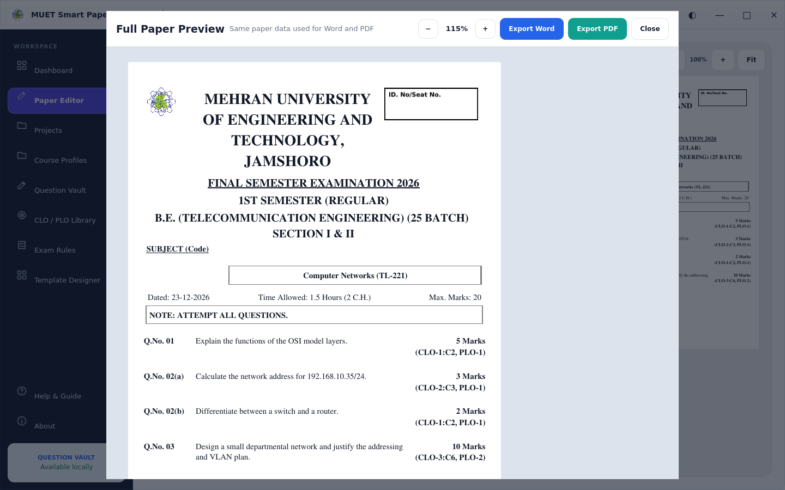

# MUET Smart Paper Composer

  

  <strong>A smarter and easier way to prepare MUET examination papers.</strong>

---

## About

**MUET Smart Paper Composer** is a Windows desktop application designed to help university teachers prepare examination papers in a consistent and organized format.

While preparing papers manually, it is easy to overlook small but important details such as the examination date, marks distribution, CLO/PLO mapping, paper structure, or formatting.

MUET Smart Paper Composer brings these tasks together in one application and provides a live preview of the paper while it is being prepared.

The application is designed primarily for the examination-paper workflow at **Mehran University of Engineering & Technology (MUET)**.

---

## Key Features

- Subject-wise Question Vault
- CLO, Bloom Level and PLO mapping support
- Marks and paper-structure checks
- Live A4 paper preview
- Microsoft Word export
- PDF export
- Editable project saving and recovery
- Question bank support
- Reuse previously prepared questions
- Structured examination-paper preparation
- Offline Windows desktop operation
- 15-day evaluation period

---

## Why Use Smart Paper Composer?

Preparing an examination paper is more than typing questions.

During manual preparation, a teacher may accidentally:

- Forget to update the examination date
- Miss CLO or PLO mapping
- Enter an incorrect marks distribution
- Leave information from a previous paper unchanged
- Spend unnecessary time adjusting formatting
- Repeatedly type questions that already exist in previous papers
- Discover formatting problems only after exporting or printing

MUET Smart Paper Composer is designed to reduce these common problems and make paper preparation faster and more consistent.

---

## Live Paper Preview

The application provides a live A4 preview so that the teacher can see how the examination paper will appear while preparing it.

This helps identify layout, spacing and paper-structure issues before final export.

---

## Question Vault

Questions can be stored subject-wise and reused when preparing future examination papers.

This allows teachers to gradually build their own organized question bank instead of searching through old Word documents whenever a new paper is required.

---

## CLO / PLO Mapping

MUET Smart Paper Composer supports:

- CLO mapping
- PLO mapping
- Bloom Level mapping

These mappings can be managed while preparing the examination paper.

---

## Screenshots

### Paper Editor

  

### Full Paper Preview

  

---

## Download

The Windows version of MUET Smart Paper Composer will be distributed through the **Releases** section of this repository.

When a release is available:

1. Open **Releases**
2. Select the latest version
3. Download the Windows installer
4. Install and launch MUET Smart Paper Composer

> **Note:** This repository is intended for product information and official application releases. The application source code is not distributed through this repository.

---

## Trial and Activation

MUET Smart Paper Composer provides a **15-day evaluation period**.

The evaluation period allows users to explore and test the application before activation.

For activation or licensing information, contact the developer.

---

## System Requirements

- Microsoft Windows
- Standard desktop or laptop computer
- No continuous internet connection required for normal application use

---

## Developer

**Dr. Nadeem Ahmed**

Email: nadeempitafi@gmail.com  
WhatsApp: +92 333 2603239

---

## Feedback

Suggestions, bug reports and feedback regarding MUET Smart Paper Composer are welcome.

For application-related queries, please contact the developer using the details provided above.

---

## Notice

MUET Smart Paper Composer is an independently developed software application intended to assist with academic examination-paper preparation.

This repository is used for product information and official Windows releases. Application source code is not distributed through this repository.

---

  <strong>MUET Smart Paper Composer</strong> 
  Designed & Developed by Dr. Nadeem Ahmed

